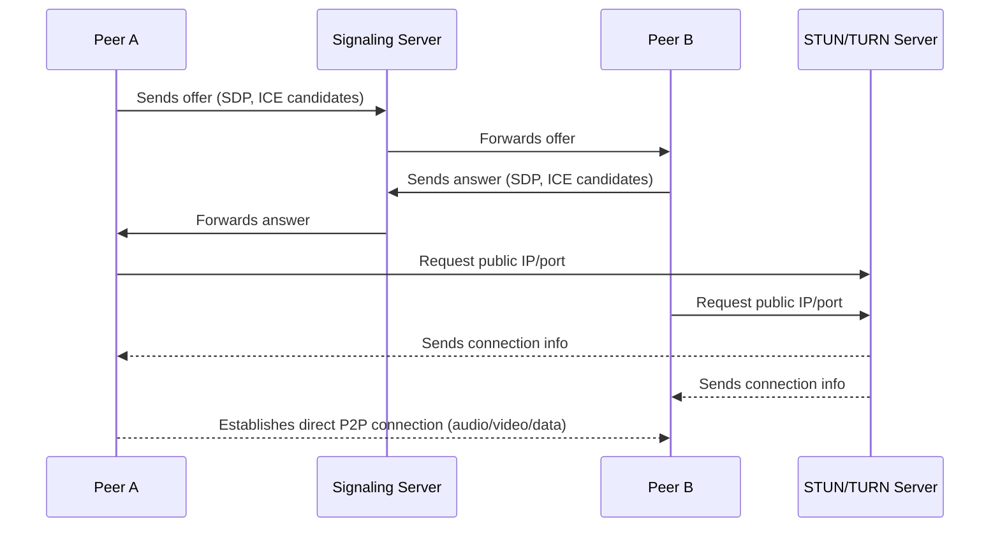

# Network Protocols: Complete Guide

## Table of Contents
1. [Introduction](#introduction)
2. [OSI Model vs TCP/IP Model](#osi-model-vs-tcpip-model)
3. [Application Protocols](#application-protocols)
4. [Transport Protocols](#transport-protocols)
5. [Internet Protocols](#internet-protocols)
6. [Network Protocols](#network-protocols)
7. [WebRTC](#webrtc)
8. [Summary](#summary)

---

## Introduction

Network protocols define rules and standards for communication between devices over networks. Understanding protocol layers and their relationships is essential for network design and troubleshooting.

**Key Concepts:**
- **OSI Model**: 7-layer theoretical framework
- **TCP/IP Model**: 4-layer practical implementation
- **Protocol Layers**: Application, Transport, Internet, Network Access
- **Protocol Types**: Application, Transport, Internet, Network protocols

---

## OSI Model vs TCP/IP Model

### What is the OSI Model

**OSI** stands for **Open Systems Interconnection** model.

It's a **conceptual framework** created by the **ISO (International Organization for Standardization)** in the 1980s to **standardize how computers communicate** over a network.

It defines **7 layers**, each with a specific role.

```
+-------------------------------------------------------------+
| 7. Application  – user-facing software (HTTP, FTP, DNS)     |
| 6. Presentation – data translation, encryption, compression |
| 5. Session      – manages connections and sessions          |
| 4. Transport    – reliable data transfer (TCP, UDP)         |
| 3. Network      – routing, addressing (IP)                  |
| 2. Data Link    – frames, MAC addresses (Ethernet)          |
| 1. Physical     – hardware, cables, bits, signals           |
+-------------------------------------------------------------+
```

🧠 Think of it as a **theoretical model** — used to understand and design network systems.

---

### What is the TCP/IP Model

**TCP/IP** stands for **Transmission Control Protocol / Internet Protocol**.

It's a **practical implementation** of networking protocols — the **foundation of the modern Internet**.

It was developed by the **U.S. Department of Defense (ARPANET project)** in the 1970s, before the OSI model.

It has **4 layers** (some sources split into 5):

```
+------------------------------------------+
| 4. Application – HTTP, FTP, DNS, SMTP    |
| 3. Transport   – TCP, UDP                |
| 2. Internet    – IP, ICMP, ARP           |
| 1. Network Access (Link) – Ethernet, Wi-Fi|
+------------------------------------------+
```

So, TCP/IP is not just a model — it's an **actual suite of protocols** used everywhere (HTTP, TCP, IP, DNS, etc.).

---

### OSI vs TCP/IP — Main Differences

| Feature                       | **OSI Model**                                        | **TCP/IP Model**                          |
| ----------------------------- | ---------------------------------------------------- | ----------------------------------------- |
| **Purpose**                   | Theoretical framework                                | Practical implementation                  |
| **Developed by**              | ISO (1984)                                           | DARPA / U.S. DoD (1970s)                  |
| **Layers**                    | 7 layers                                             | 4 (sometimes 5) layers                    |
| **Type**                      | Conceptual model                                     | Protocol suite                            |
| **Focus**                     | How network functions are structured                 | How data actually travels on the Internet |
| **Transport layer protocols** | Only defines the concept (e.g. "transport services") | Implements actual protocols — TCP, UDP    |
| **Network layer protocol**    | Defines concept of routing                           | Uses IP (Internet Protocol)               |
| **Examples**                  | Not directly used in real systems                    | Used in all Internet systems today        |

---

### OSI ↔ TCP/IP Layer Mapping

| **OSI Layer**   | **TCP/IP Layer** | **Example Protocols** |
| --------------- | ---------------- | --------------------- |
| 7. Application  | Application      | HTTP, SMTP, DNS       |
| 6. Presentation | Application      | SSL/TLS, JPEG, MP3    |
| 5. Session      | Application      | RPC, NetBIOS          |
| 4. Transport    | Transport        | TCP, UDP              |
| 3. Network      | Internet         | IP, ICMP, ARP         |
| 2. Data Link    | Network Access   | Ethernet, Wi-Fi       |
| 1. Physical     | Network Access   | Fiber, Copper, Radio  |

So — TCP/IP **merges** OSI's top 3 layers (Application, Presentation, Session) into one, and **combines** the bottom two (Data Link + Physical) into a single "Network Access" layer.

---

### In Short

| Concept            | Description                                                                              |
| ------------------ | ---------------------------------------------------------------------------------------- |
| **OSI Model**      | Conceptual blueprint — defines *what happens* in each stage of communication.            |
| **TCP/IP Model**   | Real-world implementation — defines *how* the Internet actually sends and receives data. |
| **Key difference** | OSI = theory. TCP/IP = reality.                                                          |

---

## Application Protocols

Application protocols operate at the highest layer of the network stack, providing services directly to user applications.

**Examples:**
- HTTP (Hypertext Transfer Protocol)
- FTP (File Transfer Protocol)
- DNS (Domain Name System)
- SMTP (Simple Mail Transfer Protocol)
- SSH (Secure Shell)
- WebSocket
- MQTT (Message Queuing Telemetry Transport)

**Total: 183+ application protocols**

---

## Transport Protocols

The **transport layer** (Layer 4 in OSI) is responsible for:

- Delivering data **end-to-end** between two devices
- Handling **segmentation**, **reliability**, **flow control**, and **multiplexing**

The two main protocols are:

- **TCP (Transmission Control Protocol)** — reliable, ordered, connection-oriented
- **UDP (User Datagram Protocol)** — fast, connectionless, no delivery guarantees

But there are **others** — some designed for specific use cases like congestion control, datagram encryption, or low latency.

---

### Major Transport Protocols (Besides TCP & UDP)

| Protocol    | Full Name                            | Description / Use Case                                                                                               |
| ----------- | ------------------------------------ | -------------------------------------------------------------------------------------------------------------------- |
| **SCTP**    | Stream Control Transmission Protocol | Hybrid of TCP and UDP. Supports multiple data streams and multihoming (used in telecom, WebRTC data channels).       |
| **DCCP**    | Datagram Congestion Control Protocol | Like UDP but with built-in congestion control — used for streaming or gaming where some loss is okay.                |
| **QUIC**    | Quick UDP Internet Connections       | Developed by Google; runs *over UDP* but provides TCP-like reliability + TLS + multiplexing. Used by HTTP/3.         |
| **RUDP**    | Reliable User Datagram Protocol      | A reliable, ordered delivery built on UDP (used in some real-time systems).                                          |
| **UDPLite** | UDP-Lite                             | Variant of UDP allowing partial checksum — useful for audio/video streaming where minor corruption is tolerable.     |
| **IL**      | IL Protocol (Plan 9 OS)              | Lightweight, simple transport protocol similar to TCP, used in the Plan 9 research OS.                               |
| **RTP**     | Real-time Transport Protocol         | Technically operates *above* UDP, but provides transport-like timing and sequencing for media (used in VoIP/WebRTC). |
| **MPTCP**   | Multipath TCP                        | Extension of TCP allowing a single connection to use multiple network paths (e.g., Wi-Fi + LTE).                     |
| **QUAD**    | QUIC-based Datagram                  | Under development; extends QUIC to pure datagram use cases (low-latency messaging).                                  |

---

### Summary by Function

| Type                                 | Examples              | Purpose                                   |
| ------------------------------------ | --------------------- | ----------------------------------------- |
| **Reliable, ordered delivery**       | TCP, SCTP, RUDP, QUIC | Guarantees data arrives intact & in order |
| **Unreliable, low-latency delivery** | UDP, DCCP, UDPLite    | Prioritizes speed over reliability        |
| **Multipath / multistream**          | MPTCP, SCTP           | Improves redundancy or throughput         |
| **Encrypted modern transport**       | QUIC (HTTP/3)         | Combines security (TLS) with transport    |

---

### Most Important Modern Alternatives

If you focus on today's Internet stack:

- **TCP** → traditional, reliable (used by HTTP/1.1, HTTP/2)
- **UDP** → low-latency (used by DNS, VoIP, gaming)
- **QUIC** → next-gen hybrid (used by HTTP/3, Google, Cloudflare)
- **SCTP** → telecom-grade, used in WebRTC data channels and 5G core

---

### Summary Table

| Layer 4 Protocol | Reliable? | Connection-oriented? | Common Use            |
| ---------------- | --------- | -------------------- | --------------------- |
| TCP              | ✅ Yes     | ✅ Yes                | Web, Email, SSH       |
| UDP              | ❌ No      | ❌ No                 | DNS, VoIP, Streaming  |
| SCTP             | ✅ Yes     | ✅ Yes                | Telecom, WebRTC       |
| DCCP             | ❌ Partial | ✅ Yes                | Multimedia, gaming    |
| QUIC             | ✅ Yes     | ✅ Yes                | HTTP/3, modern web    |
| RUDP             | ✅ Yes     | ✅ Yes                | Custom networking     |
| UDPLite          | ❌ Partial | ❌ No                 | Real-time audio/video |

---

### TCP vs UDP Comparison

|                  |                       |                             |
| ---------------- | --------------------- | --------------------------- |
|                  | TCP                   | UDP                         |
| Connection model | Connected. One-to-one | Connectionless. One-to-many |
| Data transfer    | ordered               | unordered                   |
| structure        | segments              | datagrams                   |
| Overhead         | Resource intensive    | lightweight                 |
| reliability      | reliable              | unreliable                  |
|                  | Byte stream           | Packet/datagrams            |
| handshake        | yes                   | no                          |
| speed            | slow                  | Fast                        |
| security         | SSL/TLS               | DTLS                        |

---

### In Short

> The Internet primarily runs on **TCP**, **UDP**, and now **QUIC**,
> but there are **at least 6–8 other standardized transport protocols**,
> each optimized for different trade-offs between **speed, reliability, and complexity**.

---

## Internet Protocols

Internet protocols operate at the network layer, handling routing and addressing.

**Examples:**
- **IP (Internet Protocol)** — IPv4 and IPv6
- **ICMP (Internet Control Message Protocol)** — error reporting and diagnostics
- **ARP (Address Resolution Protocol)** — maps IP addresses to MAC addresses

**Key Functions:**
- Packet routing
- Address assignment
- Error reporting
- Network diagnostics

---

## Network Protocols

Network protocols operate at the data link and physical layers, handling frame transmission and physical media.

**Examples:**
- **Ethernet** — wired local area networks
- **Wi-Fi (802.11)** — wireless local area networks
- **PPP (Point-to-Point Protocol)** — direct connections
- **ATM (Asynchronous Transfer Mode)** — cell-based networking

**Key Functions:**
- Frame formatting
- Media access control
- Physical transmission
- Error detection

---

## WebRTC

**WebRTC** stands for **Web Real-Time Communication**.

It's a **technology and set of open standards** that enable browsers, mobile apps, and devices to **communicate directly in real time** — sending **audio, video, and data** — **without needing a central server** in between for media transmission.

---

### What WebRTC Is

**WebRTC = Web Real-Time Communication**

It's an **open-source project + collection of protocols and APIs** standardized by the **W3C** (World Wide Web Consortium) and **IETF** (Internet Engineering Task Force).

It allows **peer-to-peer (P2P)** connections for:

- Real-time **audio calls**
- **Video calls**
- **Data sharing** (like text, files, or sensor data)

The magic is that it all works **inside your browser** (e.g., Chrome, Firefox, Safari, Edge) — **no plugins needed**.

---

### How It Works (Simplified)

WebRTC has three main parts:

| Component                      | Description                                                                                        |
| ------------------------------ | -------------------------------------------------------------------------------------------------- |
| **MediaStream (getUserMedia)** | Captures media from your microphone and camera.                                                    |
| **RTCPeerConnection**          | Establishes a secure, encrypted P2P connection between two users to exchange audio/video streams.  |
| **RTCDataChannel**             | Sends arbitrary data (e.g., chat messages, game state, files) directly between peers in real time. |

Because both browsers are usually behind routers/firewalls, they need **signaling servers** to exchange connection info first (using WebSocket, HTTP, or any protocol).

Once peers discover each other, they connect **directly via UDP** (using ICE, STUN, and TURN protocols).

---

### Protocols Involved

| Protocol                                         | Purpose                                                   |
| ------------------------------------------------ | --------------------------------------------------------- |
| **ICE (Interactive Connectivity Establishment)** | Finds the best route between peers (direct or via relay). |
| **STUN (Session Traversal Utilities for NAT)**   | Helps peers discover their public IP and port.            |
| **TURN (Traversal Using Relay NAT)**             | Relays traffic if direct connection fails.                |
| **SRTP / DTLS**                                  | Encrypts audio, video, and data securely.                 |

All communication in WebRTC is **end-to-end encrypted** by default.

---

### Where WebRTC Is Used

You've definitely used WebRTC without realizing it. Examples:

- **Google Meet**, **Zoom (Web)**, **Discord**, **Slack calls**
- **Telemedicine** apps (video consultations)
- **Online education** tools (interactive classrooms)
- **Gaming / Metaverse** (low-latency voice and data)
- **IoT / AI assistants** (real-time streaming of sensor data)
- **LiveKit**, **Jitsi**, **mediasoup**, and **Janus** — all built *on top of* WebRTC.

---

### History

- WebRTC was **announced by Google in 2011**, after acquiring Global IP Solutions (a company specializing in voice/video codecs)
- The first stable version shipped in **Chrome 23 (2012)**
- Since then, it became a **web standard (W3C Recommendation)** in **2021**

---

### WebRTC Connection Flow



**Explanation:**

- **Signaling Server:**  
    Not part of WebRTC itself — used only for exchanging session descriptions (SDP) and connection info between peers before the actual connection starts.  
    Common protocols: WebSocket, HTTP, MQTT.
    
- **STUN Server:**  
  Helps peers discover their **public IP and port** behind NAT.
    
- **TURN Server:**  
  Relays traffic if a **direct P2P connection fails** (e.g., due to strict firewalls).
    
- **Peer A ↔ Peer B:**  
  Once ICE negotiation completes, they stream **encrypted audio/video/data** directly over UDP.

---

### WHIP — WebRTC-HTTP Ingestion Protocol

**Purpose:**
WHIP defines **how to send (ingest) a live WebRTC stream** into a server using a simple **HTTP-based API** instead of custom signaling.

**Why it exists:**
Traditional WebRTC apps require complex signaling steps to start a session. WHIP simplifies this by standardizing the "publisher → server" part of the connection.

**Typical use:**
A browser, OBS, or mobile app sends live audio/video to a **media server** (e.g., LiveKit, Janus, or Wowza) using HTTP POST with WebRTC offer (SDP).

The server responds with an SDP answer → connection established → WebRTC stream starts.

**Analogy:**
Like RTMP but modern, secure, and WebRTC-native.

---

### RTMP — Real-Time Messaging Protocol

**Purpose:**
Legacy protocol for **live streaming video and audio** over TCP.

**Developed by:**
Macromedia (later Adobe) for Flash Player (around early 2000s).

**How it works:**

- Client connects to server via TCP (port 1935)
- Streams audio/video data using the FLV container format
- Server can restream to CDN or other clients

**Still used for:**

- Uploading (ingesting) streams from OBS → YouTube Live, Twitch, Facebook, etc.
- Even though Flash is gone, RTMP ingestion remains common because it's simple and widely supported

**But:**
RTMP is **not low latency** (1–5 seconds delay), **not encrypted by default**, and **not browser-native**.

WebRTC + WHIP is the modern replacement.

---

### STUN — Session Traversal Utilities for NAT

**Purpose:**
STUN helps WebRTC peers **discover their public IP address and port** when they are behind a NAT (home router).

**How it works:**

- Peer sends a STUN request to a STUN server on the Internet
- Server replies with "You appear as IP X, port Y."
- Peer advertises that info to other peers to try direct connection

**Example:**
Google provides free STUN servers:
`stun.l.google.com:19302`

**Limitation:**
STUN alone doesn't work if NAT/firewall is too strict — that's when TURN is needed.

---

### TURN — Traversal Using Relays around NAT

**Purpose:**
Fallback mechanism when STUN cannot establish a direct peer connection.

**How it works:**

- Both peers send their media streams **via a TURN relay server**
- The TURN server forwards packets between them

**Pros:**
✅ Works even behind strict firewalls.

**Cons:**
❌ Adds latency
❌ Costs bandwidth (because all data goes through server)

**Typical setup:**
You deploy a TURN server (like `coturn`) to guarantee reliable connectivity for WebRTC.

---

### How They Relate

| Protocol | Layer             | Purpose                                | Used In                         |
| -------- | ----------------- | -------------------------------------- | ------------------------------- |
| **WHIP** | HTTP API          | Standard way to start WebRTC ingestion | LiveKit, OBS, streaming servers |
| **RTMP** | TCP streaming     | Legacy live video ingestion            | YouTube, Twitch, Facebook       |
| **STUN** | Network discovery | Find public IP for P2P                 | WebRTC ICE negotiation          |
| **TURN** | Relay             | Send media via server if direct fails  | WebRTC fallback path            |

---

## Summary

**Network Protocol Layers:**
- **Application Layer**: HTTP, FTP, DNS, SMTP, SSH, WebSocket, MQTT (183+ protocols)
- **Transport Layer**: TCP, UDP, SCTP, DCCP, QUIC, RUDP, UDPLite, RTP, MPTCP, QUAD
- **Internet Layer**: IP, ICMP, ARP
- **Network Access Layer**: Ethernet, Wi-Fi, PPP, ATM

**Key Models:**
- **OSI Model**: 7-layer theoretical framework
- **TCP/IP Model**: 4-layer practical implementation

**WebRTC:**
- Real-time peer-to-peer communication
- Uses ICE, STUN, TURN for NAT traversal
- End-to-end encrypted by default
- Used in video conferencing, gaming, IoT

**Key Takeaways:**
- OSI is theoretical; TCP/IP is practical
- Transport protocols balance reliability vs. speed
- WebRTC enables browser-based real-time communication
- Modern protocols (QUIC, WHIP) improve on legacy (RTMP)
- Understanding protocol layers helps with troubleshooting

Understanding network protocols and their relationships is essential for designing, implementing, and troubleshooting network systems.
