# SSL, TLS, and CA Certificates: Complete Guide

## Table of Contents
1. [Introduction](#introduction)
2. [SSL vs TLS](#ssl-vs-tls)
3. [How SSL/TLS Works](#how-ssltls-works)
4. [Symmetric vs Asymmetric Encryption](#symmetric-vs-asymmetric-encryption)
5. [CA Certificates](#ca-certificates)
6. [Summary](#summary)

---

## Introduction

SSL (Secure Sockets Layer) and its successor TLS (Transport Layer Security) are cryptographic protocols designed to provide secure communication over the internet. They ensure that data transmitted between a client (like your browser) and a server (like a website) remains private and tamper-proof.

**Key Concepts:**
- **Encryption**: Scrambles data so only the intended recipient can read it
- **Authentication**: Verifies the identity of the server (and sometimes the client)
- **Integrity**: Ensures the data isn't altered during transit

---

## SSL vs TLS

The difference between SSL (Secure Sockets Layer) and TLS (Transport Layer Security) lies in their history, development, and technical improvements. While they serve the same purpose—securing communication over the internet—TLS is the modern, more secure successor to SSL.

---

### Historical Context

**SSL:**
- Developed by Netscape in the 1990s
- **SSL 1.0**: Never released (too flawed)
- **SSL 2.0**: Released in 1995, but quickly found vulnerable
- **SSL 3.0**: Released in 1996, the last and most widely used version of SSL (deprecated in 2015 due to security flaws like POODLE)

**TLS:**
- Introduced as an upgrade to SSL by the Internet Engineering Task Force (IETF)
- **TLS 1.0**: Released in 1999, essentially "SSL 3.1" with minor improvements
- **TLS 1.1**: Released in 2006
- **TLS 1.2**: Released in 2008, widely adopted
- **TLS 1.3**: Released in 2018, a major overhaul for speed and security

**Key Point:** SSL is the original protocol, now obsolete. TLS is the current standard, actively maintained and improved.

---

### Security

**SSL:**
- Has known vulnerabilities
- **SSL 2.0**: Weak encryption and no protection against man-in-the-middle attacks
- **SSL 3.0**: Susceptible to attacks like POODLE (Padding Oracle On Downgraded Legacy Encryption), which exploits its outdated cipher block chaining (CBC) mode

**TLS:**
- Continuously patched and strengthened
- **TLS 1.0 and 1.1**: Improved over SSL but still have weaknesses (e.g., vulnerable to BEAST and other attacks; deprecated in 2021)
- **TLS 1.2**: Supports stronger ciphers (e.g., AES with GCM mode) and better key exchange methods
- **TLS 1.3**: Removes outdated features (e.g., MD5, SHA-1, RSA key exchange), resists more attacks, and enforces perfect forward secrecy (PFS)

**Key Point:** TLS is far more secure, especially in its later versions, while SSL is considered broken by today's standards.

---

### Handshake Process

**SSL:**
- Slower and less flexible
- Uses older key exchange methods like RSA, which can be decrypted if the private key is compromised later (no forward secrecy)
- More steps and less efficient negotiation of cipher suites

**TLS:**
- Streamlined and more secure
- **TLS 1.2**: Supports Diffie-Hellman (DH) and Elliptic Curve Diffie-Hellman (ECDH) for forward secrecy, meaning past sessions stay secure even if a key is later exposed
- **TLS 1.3**: Simplifies the handshake (one round-trip instead of two), removes weak options, and mandates forward secrecy

**Key Point:** TLS handshakes are faster and safer, especially in TLS 1.3.

---

### Cipher Suites

**SSL:**
- Relies on older, weaker cryptographic algorithms
- Examples: RC4, MD5, DES—all now considered insecure

**TLS:**
- Uses modern, stronger algorithms
- **TLS 1.2**: Supports AES, SHA-256, and more robust options
- **TLS 1.3**: Drops legacy ciphers entirely (e.g., no RC4 or SHA-1), focusing on authenticated encryption like AES-GCM

**Key Point:** TLS offers better encryption options, while SSL's ciphers are outdated and exploitable.

---

### Usage Today

**SSL:**
- No longer used in practice
- When people say "SSL," they often mean TLS (a common misnomer)

**TLS:**
- The standard for secure communication (e.g., HTTPS, email encryption, VPNs)
- As of April 2025, TLS 1.2 and 1.3 dominate, with TLS 1.0 and 1.1 phased out by most browsers and servers

---

### Summary Table

| Feature              | SSL                          | TLS                          |
|----------------------|------------------------------|------------------------------|
| **Origin**           | Netscape, 1990s             | IETF, 1999 onward           |
| **Latest Version**   | SSL 3.0 (1996)              | TLS 1.3 (2018)              |
| **Security**         | Vulnerable, deprecated      | Strong, actively updated    |
| **Handshake**        | Slower, less secure         | Faster, forward secrecy     |
| **Ciphers**          | Weak (e.g., RC4, MD5)       | Strong (e.g., AES, SHA-256) |
| **Current Use**      | Obsolete                    | Standard (TLS 1.2, 1.3)     |

---

## How SSL/TLS Works

### Purpose of SSL/TLS

- **Encryption**: Scrambles data so only the intended recipient can read it
- **Authentication**: Verifies the identity of the server (and sometimes the client)
- **Integrity**: Ensures the data isn't altered during transit

---

### The Handshake Process

When you connect to a secure website (e.g., one starting with "https"), the SSL/TLS handshake happens behind the scenes to establish a secure connection.

```mermaid
sequenceDiagram
    participant Browser
    participant Server
    participant CA as Certificate Authority

    Browser->>Server: 1️⃣ Hello (ClientHello)
    Server-->>Browser: 2️⃣ Sends TLS certificate
    Browser->>CA: 3️⃣ Verify certificate authenticity (using CA's public key)
    CA-->>Browser: 4️⃣ Valid
    Browser->>Server: 5️⃣ Generate random session key (encrypt with server's public key)
    Server-->>Browser: 6️⃣ Decrypt session key (with private key)
    Browser-->>Server: 🔒 7️⃣ Start encrypted communication
```

---

#### a) Client Hello

The client (your browser) sends a "hello" message to the server. It includes:

- Supported TLS versions (e.g., TLS 1.2, 1.3)
- A list of cipher suites (encryption algorithms it can use, like AES or RSA)
- A random string of bytes (called a "client random") for later use in key generation

---

#### b) Server Hello

The server responds with its own "hello" message. It picks:

- The TLS version to use
- A cipher suite from the client's list
- Its own random string ("server random")

The server also sends its **digital certificate**, which contains:

- The server's public key
- Identity info (e.g., domain name)
- A signature from a trusted Certificate Authority (CA)

---

#### c) Certificate Verification

The client checks the server's certificate:

- Is it signed by a trusted CA? (Your browser has a list of trusted CAs)
  - Does the domain match the certificate?
  - Has it expired or been revoked?

If the certificate is valid, the client trusts the server.

---

#### d) Key Exchange

- The client generates a **pre-master secret** (a random value)
- It encrypts this secret with the server's public key (from the certificate) and sends it to the server
- The server decrypts it using its private key
- Both sides now use the pre-master secret, client random, and server random to independently generate the same **session key** (a symmetric key)

---

#### e) Secure Connection Established

- The handshake finishes with both sides confirming they're ready
- From now on, all data is encrypted with the session key using a fast symmetric encryption algorithm (like AES)

---

### Data Transmission

- Once the handshake is complete, the client and server use the session key to encrypt and decrypt all communication
- Symmetric encryption is used because it's much faster than asymmetric encryption (like RSA), which is only used during the handshake

---

### Key Features in Action

- **Encryption**: An eavesdropper sees only gibberish
- **Authentication**: The certificate ensures you're talking to the real server, not an impostor
- **Integrity**: A Message Authentication Code (MAC) or similar mechanism ensures data isn't tampered with

---

### TLS Versions

- SSL is outdated (SSL 3.0 was the last version, deprecated in 2015)
- TLS has evolved: TLS 1.0 (1999), 1.1 (2006), 1.2 (2008), and 1.3 (2018)
- TLS 1.3 is faster and more secure, removing old, vulnerable features and streamlining the handshake

---

### Simplified Example

Imagine you're mailing a locked box:

- You ask the recipient what lock they support (Client Hello)
- They send you their public lock and a certificate proving it's theirs (Server Hello)
- You verify the certificate, put a secret key in the box, and lock it with their public lock (Key Exchange)
- They unlock it with their private key, and now you both use that secret key to lock/unlock future messages

That's SSL/TLS in a nutshell! It's a blend of asymmetric cryptography (for the handshake) and symmetric cryptography (for the data), all wrapped in a process that's invisible to the user but critical for security.

---

## Symmetric vs Asymmetric Encryption

### Symmetric Encryption

**Definition:**
Uses a single key to both encrypt and decrypt data.

**How It Works:**
- The sender and receiver share the same secret key
- The sender encrypts the data with the key, and the receiver decrypts it with the same key

**Key Characteristics:**
- **Speed**: Very fast because it uses simpler algorithms
- **Key Management**: The challenge is securely sharing the key—if it's intercepted, the encryption is compromised

**Algorithms:**
  - AES (Advanced Encryption Standard)
  - DES (Data Encryption Standard, now outdated)
  - 3DES (Triple DES)
  - ChaCha20

**Use Cases:**
- Encrypting large amounts of data (e.g., files, disk drives)
- Securing data in transit after a key is established (e.g., TLS session encryption)

**Analogy:**
Like a locked box with one key—both sender and receiver need a copy of that key.

---

### Asymmetric Encryption

**Definition:**
Uses a pair of keys: a public key (shared openly) and a private key (kept secret).

**How It Works:**
- Data encrypted with the public key can only be decrypted with the matching private key (and vice versa)
- The public key is freely distributed, while the private key is never shared

**Key Characteristics:**
- **Speed**: Slower because it relies on complex math (e.g., large prime numbers)
- **Key Management**: No need to secretly share keys—the public key can be sent openly

**Algorithms:**
  - RSA (Rivest-Shamir-Adleman)
  - ECC (Elliptic Curve Cryptography)
  - Diffie-Hellman (for key exchange, though not encryption directly)

**Use Cases:**
- Secure key exchange (e.g., TLS handshake)
- Digital signatures (proving authenticity)
- Encrypting small data like passwords or keys

**Analogy:**
Like a mailbox—anyone can drop a letter in (public key), but only the owner with the key (private key) can open it.

---

### Key Differences

| Feature              | Symmetric Encryption         | Asymmetric Encryption        |
|----------------------|------------------------------|------------------------------|
| **Keys**             | One shared key              | Two keys: public and private |
| **Speed**            | Fast                        | Slow                         |
| **Key Distribution** | Must be shared securely     | Public key shared openly     |
| **Security**         | Relies on key secrecy       | Relies on private key secrecy|
| **Data Size**        | Good for large data         | Best for small data          |
| **Examples**         | AES, DES                    | RSA, ECC                     |
| **Use in Practice**  | Bulk data encryption        | Key exchange, signatures     |

---

### How They Work Together (e.g., in SSL/TLS)

- **Asymmetric**: Used in the TLS handshake to securely exchange a session key
  - The client encrypts a pre-master secret with the server's public key
  - The server decrypts it with its private key
- **Symmetric**: Once the session key is established, it's used for fast, efficient encryption of the actual data

---

### Pros and Cons

**Symmetric:**
- *Pros*: Speed, efficiency
- *Cons*: Key distribution is a security risk

**Asymmetric:**
- *Pros*: Solves key distribution, enables authentication
- *Cons*: Computationally intensive, impractical for large data

---

### Real-World Example

- **Symmetric**: Encrypting a hard drive with AES—only you know the key
- **Asymmetric**: Sending an encrypted email with PGP—your recipient uses your public key to encrypt, and you use your private key to decrypt

In essence, symmetric is about speed and simplicity with a shared secret, while asymmetric is about security and flexibility with a key pair. They're often combined to get the best of both worlds!

---

## CA Certificates

A **CA certificate** (Certificate Authority certificate) is a digital certificate issued by a trusted entity called a **Certificate Authority (CA)**. It plays a critical role in establishing trust and security on the internet, particularly in protocols like SSL/TLS.

---

### What Is a CA Certificate?

- A CA certificate is a public key certificate that verifies the identity of an entity (e.g., a website, organization, or individual) and binds that identity to a cryptographic public key
- It's signed by a Certificate Authority, a trusted third party responsible for issuing and managing these certificates
- Think of it as a digital ID card vouched for by a reliable authority

---

### Key Components of a CA Certificate

A CA certificate contains:

1. **Subject**: The entity it's issued to (e.g., a domain like "www.example.com")
2. **Public Key**: The key used for encryption or verifying signatures
3. **Issuer**: The CA that issued the certificate (e.g., Let's Encrypt, DigiCert, GlobalSign)
4. **Validity Period**: Start and end dates during which the certificate is valid
5. **Serial Number**: A unique identifier for the certificate
6. **Digital Signature**: The CA's cryptographic signature, proving the certificate's authenticity
7. **Extensions**: Additional info (e.g., usage constraints, alternate domain names)

---

### Role of the Certificate Authority (CA)

A CA is a trusted organization that:

- Verifies the identity of the certificate requester (e.g., confirming a website belongs to its claimed owner)
- Issues the certificate by signing it with its own private key
- Maintains a list of revoked certificates (via a Certificate Revocation List, or CRL)

**Examples of CAs:**
Let's Encrypt, Comodo, Sectigo, VeriSign, DigiCert

---

### How It Works in SSL/TLS

#### 1. Server Certificate

- When you visit a secure site (e.g., "https://www.example.com"), the server sends its CA-issued certificate to your browser
- This certificate includes the server's public key and is signed by the CA

#### 2. Trust Verification

- Your browser checks the certificate's signature using the CA's public key (pre-installed in the browser's trust store)
- If the signature is valid and the CA is trusted, the browser trusts the server

#### 3. Chain of Trust

Certificates often form a hierarchy:

- **Root CA**: The top-level CA issues its own self-signed root certificate
- **Intermediate CA**: Receives a certificate from the root CA and issues certificates to end entities (like websites)
- **End-Entity Certificate**: The certificate for the specific server (e.g., "www.example.com")

Your browser verifies the chain from the server's certificate up to a trusted root CA.

#### 4. Encryption Setup

- Once trust is established, the browser uses the server's public key (from the certificate) to securely exchange a session key for symmetric encryption

---

### Types of CA Certificates

- **Root Certificate**: Issued by a root CA to itself (self-signed). These are pre-installed in browsers and operating systems
- **Intermediate Certificate**: Issued by a root CA to another CA, which then issues certificates to end users. Used to keep the root CA offline and secure
- **End-Entity Certificate**: Issued to a specific entity (e.g., a website or server). This is what you encounter most often (e.g., an SSL/TLS certificate)

---

### Why Are CA Certificates Important?

- **Authentication**: Ensures you're connecting to the real "www.example.com," not a fake site
- **Encryption**: Enables secure key exchange for encrypted communication
- **Trust**: Relies on a system of trusted CAs to prevent impersonation

---

### How Trust Is Built

- Browsers and operating systems come with a **trust store**—a list of trusted root CA certificates (e.g., from Microsoft, Apple, Mozilla)
- If a CA's root certificate is in the trust store, any certificate it signs (directly or via intermediates) is trusted, assuming it's valid and not revoked

---

### Example in Action

- You visit "https://www.google.com"
- Google's server sends a certificate signed by an intermediate CA (e.g., Google Trust Services), which chains back to a root CA (e.g., GlobalSign)
- Your browser verifies the chain against its trusted root certificates
- If all checks pass (valid signature, unexpired, not revoked), the connection proceeds securely

---

### Potential Issues

- **Expired Certificates**: The connection fails if the certificate is out of date
- **Untrusted CA**: If the CA isn't in the trust store, you'll see a warning (e.g., "Not Secure")
- **Revoked Certificates**: If a certificate is compromised, the CA revokes it, and browsers check this via CRLs or OCSP (Online Certificate Status Protocol)

---

### Fun Fact

The "padlock" icon in your browser? That's thanks to a valid CA certificate making the SSL/TLS connection possible!

---

## Summary

**SSL vs TLS:**
- SSL is obsolete; TLS is the current standard
- TLS 1.2 and 1.3 are the recommended versions
- TLS provides better security, faster handshakes, and stronger encryption

**Encryption Types:**
- **Symmetric**: Fast, uses one shared key (AES, ChaCha20)
- **Asymmetric**: Secure key exchange, uses public/private key pairs (RSA, ECC)
- **Combined**: Asymmetric for handshake, symmetric for data transmission

**CA Certificates:**
- Verify server identity
- Enable secure key exchange
- Form a chain of trust from root CA to end-entity certificate
- Pre-installed in browsers and operating systems

**Key Takeaways:**
- Always use TLS (not SSL) for secure communication
- TLS 1.3 provides the best security and performance
- CA certificates are essential for establishing trust
- Symmetric and asymmetric encryption work together in TLS
- The padlock icon indicates a valid CA certificate

Understanding SSL/TLS and CA certificates is essential for secure web communication and network security.
